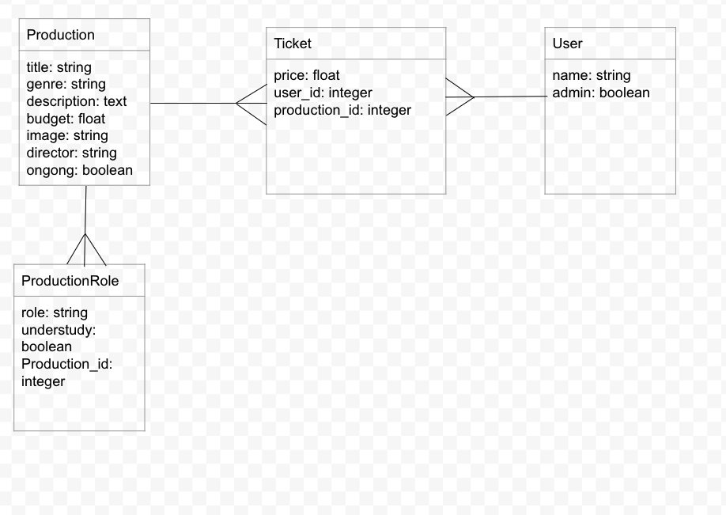

# Phase-4-032122

# Lecture Ground Rules 
 
- The moment you are confused raise your hand. If you are confused someone else is too, you're not alone and they will be grateful you asked. 
- "I don't know" is OK. You learn more from being wrong. It's okay to be wrong, embrace being wrong so you can learn more! 
- The more you participate the more you learn! 
- Cameras on please! If you can't have your cameras message me. 

## Rails Fundamentals and CRUD

- Phase Objectives 
- Create RESTful APIs
- Validate data
- Share data between a frontend JavaScript (React) application and a backend API application
- Build authentication into APIs
- Deploy backend applications

## SWBAT

- [] Explain convention over configuration and why this is important in rails
- [] Explain MVC and how it relates to rails
- [] Use rails new to create a project 
- [] Configure CORS
- [] Use rails generators to create model, controller and migrations 


### The Deliverables 
We have been hired by the city theater company to re-design their website.
The website should have a client built-in react and a ruby on rails backend. 

Flatiron Theater Company 
Performance
ProductionRole  
Tickets
User 



### Convention over configuration

Rails make the assumption we use specific programming conventions. By following these conventions it removes the need to do redundant configuration that would be similar if not the same in every rails application. 
This allows developers to be more productive so they can focus on the things that make their applications unique. It also lowers the barrier of entry for rails newbies! 

### Sinatra vs Rails


### Steps for building a rails app 
- [] Create rails app
```
rails new flatiron-theater-api --api --minimal --skip-javascript -T

```

- [] Configure CORS
```
#Gemfile
gem 'rack-cors'

# config/initializers/cores.rb
 Rails.application.config.middleware.insert_before 0, Rack::Cors do
   allow do
     origins '*'

     resource '*',
       headers: :any,
       methods: [:get, :post, :put, :patch, :delete, :options, :head]
   end
 end

```
- [] Create models, migrations and controllers with Rails generators 
> Note: Do not use Scaffold during phase-4 
```
#List generators 
rails generate

# Create controller 
rails g controller 

# Create model and migration
rails g model

# Create migration 
rails g migration 

# Creates model, migration, controller and routes 
rails g resource model_name attribute:data_type 

ex:
# rails g resource model_name attribute:data_type 
rails g resource production title genre description:text budget:float image director ongoing:boolean

# relationships can be generated with belongs_to or references, belongs_to  is an alias for references. 
rails g resource production_role role understudy:boolean production:belongs_to


```

- [] Verify migrations and Migrate 

```
rails db:migrate
```

- [] Build out relationships 

```
class Production < ApplicationRecord
    has_many :production_roles
    has_many :tickets
    has_many :users, through: :tickets
end

class ProductionRole < ApplicationRecord
  belongs_to :production
end

class Ticket < ApplicationRecord
  belongs_to :production
  belongs_to :user
end

class User < ApplicationRecord
    has_many :tickets
    has_many :productions, through: :tickets
end

```

- [] Create Seeds
- [] Restrict routes 
```
# config/routes
Rails.application.routes.draw do
  resources :tickets
  # resources :tickets
  # resources :users
  # resources :production_roles
  resources :productions, only: [:index, :show]
end

# verify routes in the console 
rails routes 

```

- [] Add actions
```
class ProductionsController < ApplicationController
    def index
        render json: Production.all
    end 

    def show
        production = Production.find(params[:id])
        render json: production, include: :production_roles
    end
end


```

- [] Run server 

```
rails s
```